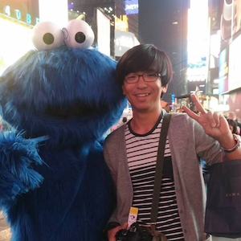

## About Me

Hi! My name is Hyunwoo Kim. I am a Master's student at School of Computing, KAIST. I am a member of [KIXLAB](https://kixlab.org), directed by [Juho Kim](https://juhokim.com). I am interested in helping people to express their opinions in a more persuasive way with computer systems.  

You can reach me at khw0726 (at) kaist (dot) ac (dot) kr.

## Education

* March 2013 - August 2017 : B.S. in Chemistry & Computer Science, KAIST

<!-- ## Typography

This is a [link](http://google.com). Something *italics* and something **bold**.

Here is a table

Year | Award | Category
-----|-------|--------
2014 | Emmy  | Won Outstanding Lead Actor in a miniseries or a movie
2015 | BAFTA | Nominated for Best Leading Actor for Sherlock
2014 | Satellite | Won Best Actor miniseries or television film

Here is a horizontal rule

---

Here is a blockquote

> To a great mind, nothing is little -->

