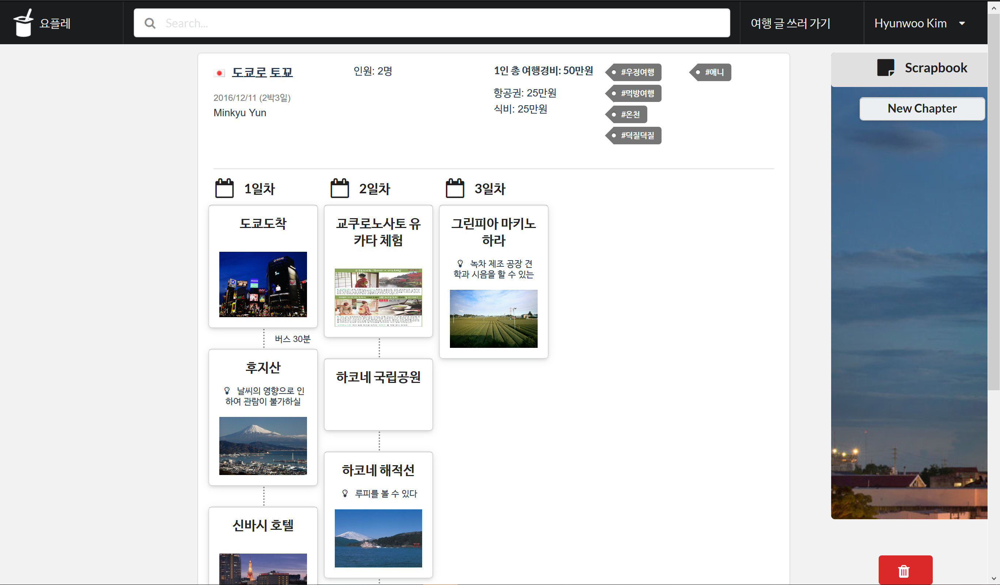

## Class Projects

### Noonchi-Baekdan
###### CS492 Crowdsourcing & Social Computing, Fall 2017

Web service for asking the hidden meaning of mobile conversations

[Video](https://youtu.be/24dy5Z9G1cg)

[Live interface](https://crowdsourcing.hyunwoo.me) (In Korean)

---

### OverWatch
###### CS584 Human-Computer Interaction, Fall 2017

Notification UI for smartwatches with notification grouping

[Video](https://youtu.be/xeDZn7mDO-o)
---
### Cooky
###### CS374 Introduction to Human-Computer Interaction, Spring 2017

Web interface for distributing cooking steps during collaborative cooking

[Video](https://youtu.be/cMA56X1iGWg)
---
### Maestro
###### CS408 Computer Science Project, Spring 2017

Smartwatch-based presentation remote
---
### Technovalley
###### CS496 Entrepreneurship and Immersive Programming Camp, Winter 2016

Browser extension for scrapping web pages & sharing
---
### Yoplait
###### CS496 Entrepreneurship and Immersive Programming Camp, Winter 2016

Travel planning & itinerary sharing service
---
### Sally
###### CS496 Entrepreneurship and Immersive Programming Camp, Winter 2016

Diary with sentiment analysis
---